# ProjectAlpha Database Data Flow Diagram

## Overview
This diagram shows all data inputs that flow into the ProjectAlpha PostgreSQL database, organized by source and destination.

---

## Main Data Flow Diagram

```mermaid
graph TB
    subgraph External_Sources["EXTERNAL DATA SOURCES"]
        SELLER[Seller Tape Files<br/>Excel/CSV]
        STATEBRIDGE[StateBridge FTPS<br/>Daily Loan Data]
        BROKERS[Broker Portal<br/>External Valuations]
        SHAREPOINT_EXT[SharePoint<br/>Document Storage]
        GEOCODIO[Geocodio API<br/>Geocoding Service]
        AI_SERVICES[AI Services<br/>Gemini/Claude]
    end

    subgraph File_Imports["FILE IMPORT SOURCES"]
        AM_FILES[AM Data Files<br/>CSV/Excel]
        MASTER_DATA[Master Reference<br/>Files]
        AWARD_FILES[Award/Drop<br/>Asset Files]
    end

    subgraph User_Inputs["USER-DRIVEN INPUTS"]
        UI_FORMS[Web UI Forms<br/>React/Vue]
        API_ENDPOINTS[REST API Endpoints<br/>Django REST Framework]
        ADMIN_PANEL[Django Admin<br/>Interface]
    end

    subgraph Scheduled_Jobs["AUTOMATED PROCESSES"]
        CRON_JOBS[Railway CRON Jobs<br/>Daily Imports]
        SIGNALS[Django Signals<br/>Post-Save Hooks]
        BG_TASKS[Background Tasks<br/>Auto-Processing]
    end

    subgraph Database["POSTGRESQL DATABASE"]
        subgraph Core_Schema["CORE SCHEMA"]
            ASSET_HUB[(AssetIdHub<br/>Asset Master)]
            CRM[(MasterCRM<br/>FirmCRM)]
            FINANCIALS[(GeneralLedger<br/>Valuations)]
            EVENTS[(CalendarEvent<br/>Notifications)]
            DOCS[(Document<br/>Photo)]
            ENRICHMENT[(LlDataEnrichment)]
            REFERENCE[(StateReference<br/>CountyReference<br/>MSAReference)]
            ASSUMPTIONS[(FCTimelines<br/>Servicer)]
        end

        subgraph Seller_Schema["SELLER_DATA SCHEMA"]
            SELLER_DATA[(SellerRawData<br/>Trade<br/>Seller)]
            TRADE_ASSUMPTIONS[(TradeLevelAssumption<br/>LoanLevelAssumption)]
        end

        subgraph AM_Schema["AM MODULE"]
            AM_TASKS[(REOTask<br/>FCTask<br/>DILTask)]
            AM_OUTCOMES[(REOData<br/>FCSale<br/>ShortSale)]
            AM_BOARDED[(BlendedOutcomeModel<br/>ServicerData)]
        end

        subgraph ETL_Schema["ETL MODULE"]
            STATEBRIDGE_DATA[(SBDailyLoanData<br/>SBDailyArmData<br/>SBDailyForeclosure)]
            IMPORT_MAPS[(ImportMapping<br/>DocumentExtraction)]
        end

        subgraph SharePoint_Schema["SHAREPOINT MODULE"]
            SP_DOCS[(SPDocument)]
        end

        subgraph Auth_Schema["USER ADMIN"]
            AUTH[(BrokerTokenAuth<br/>UserProfile)]
        end
    end

    %% External Source Flows
    SELLER -->|AI Column Mapping| SELLER_DATA
    SELLER -->|Geocode Trigger| GEOCODIO
    GEOCODIO -->|Lat/Long| ENRICHMENT
    SELLER -->|Auto-Create Hub| ASSET_HUB

    STATEBRIDGE -->|FTPS Daily Pull| CRON_JOBS
    CRON_JOBS -->|Bulk Insert| STATEBRIDGE_DATA

    BROKERS -->|Token Auth| AUTH
    BROKERS -->|BPO Values| FINANCIALS
    BROKERS -->|Photos/Docs| DOCS

    SHAREPOINT_EXT -->|Upload/Sync| SP_DOCS
    SHAREPOINT_EXT -->|Metadata| DOCS

    AI_SERVICES -->|Column Mapping| IMPORT_MAPS
    AI_SERVICES -->|Document Summary| SELLER_DATA

    %% File Import Flows
    AM_FILES -->|Management Commands| AM_BOARDED
    AM_FILES -->|Task Imports| AM_TASKS
    AM_FILES -->|Outcome Imports| AM_OUTCOMES

    MASTER_DATA -->|Bulk Import| REFERENCE
    MASTER_DATA -->|CRM Import| CRM
    MASTER_DATA -->|GL Import| FINANCIALS

    AWARD_FILES -->|Award/Drop Status| SELLER_DATA

    %% User Input Flows
    UI_FORMS -->|Form Submit| API_ENDPOINTS
    API_ENDPOINTS -->|Create/Update| SELLER_DATA
    API_ENDPOINTS -->|Assumptions| TRADE_ASSUMPTIONS
    API_ENDPOINTS -->|Assumptions| ASSUMPTIONS
    API_ENDPOINTS -->|CRM Contacts| CRM
    API_ENDPOINTS -->|GL Entries| FINANCIALS
    API_ENDPOINTS -->|Valuations| FINANCIALS
    API_ENDPOINTS -->|Events| EVENTS
    API_ENDPOINTS -->|Documents| DOCS
    API_ENDPOINTS -->|Tasks| AM_TASKS
    API_ENDPOINTS -->|Outcomes| AM_OUTCOMES

    ADMIN_PANEL -->|Direct CRUD| SELLER_DATA
    ADMIN_PANEL -->|Direct CRUD| CRM
    ADMIN_PANEL -->|Direct CRUD| ASSET_HUB
    ADMIN_PANEL -->|Direct CRUD| EVENTS

    %% Automated Process Flows
    SIGNALS -->|Auto-Geocode| ENRICHMENT
    SIGNALS -->|Auto-Notify| EVENTS
    SIGNALS -->|Auto-Folder| SP_DOCS

    BG_TASKS -->|PDF Convert| SP_DOCS
    BG_TASKS -->|Template Folders| SP_DOCS

    %% Style Definitions
    classDef externalClass fill:#ff9999,stroke:#cc0000,stroke-width:2px,color:#000
    classDef fileClass fill:#99ccff,stroke:#0066cc,stroke-width:2px,color:#000
    classDef userClass fill:#99ff99,stroke:#00cc00,stroke-width:2px,color:#000
    classDef autoClass fill:#ffcc99,stroke:#ff6600,stroke-width:2px,color:#000
    classDef dbClass fill:#cc99ff,stroke:#6600cc,stroke-width:2px,color:#000

    class SELLER,STATEBRIDGE,BROKERS,SHAREPOINT_EXT,GEOCODIO,AI_SERVICES externalClass
    class AM_FILES,MASTER_DATA,AWARD_FILES fileClass
    class UI_FORMS,API_ENDPOINTS,ADMIN_PANEL userClass
    class CRON_JOBS,SIGNALS,BG_TASKS autoClass
    class ASSET_HUB,CRM,FINANCIALS,EVENTS,DOCS,ENRICHMENT,REFERENCE,ASSUMPTIONS,SELLER_DATA,TRADE_ASSUMPTIONS,AM_TASKS,AM_OUTCOMES,AM_BOARDED,STATEBRIDGE_DATA,IMPORT_MAPS,SP_DOCS,AUTH dbClass
```

---

## Detailed Data Input Breakdown

### 1. EXTERNAL DATA SOURCES

#### 🔴 Seller Tape Upload (Primary Acquisition Source)
- **Format:** Excel/CSV files
- **Entry Point:** `POST /api/acq/import-seller-tape/`
- **Processing:**
  - AI-powered column mapping via Gemini API
  - Geocoding via Geocodio API for address enrichment
  - Auto-creation of AssetIdHub records
- **Target Models:**
  - `acq_module.SellerRawData` (primary)
  - `acq_module.Seller`
  - `acq_module.Trade`
  - `core.AssetIdHub`
  - `core.LlDataEnrichment` (geocoding)

#### 🔴 StateBridge FTPS (Daily Servicer Data)
- **Format:** FTPS file transfer
- **Schedule:** Daily automated import via Railway CRON
- **Command:** `python manage.py import_statebridge_from_ftps`
- **Target Models:**
  - `etl.SBDailyLoanData`
  - `etl.SBDailyArmData`
  - `etl.SBDailyForeclosureData`
  - `etl.SBDailyBankruptcyData`
  - `etl.SBDailyCommentData`
  - `etl.SBDailyPayHistoryData`
  - `etl.SBDailyTransactionData`

#### 🔴 Broker Portal (External Valuation Input)
- **Access:** Token-based public API
- **Endpoints:**
  - `POST /api/acq/broker-invites/<token>/submit/` - BPO valuations
  - `POST /api/acq/broker-invites/<token>/photos/` - Property photos
  - `POST /api/acq/broker-invites/<token>/documents/` - Supporting docs
- **Target Models:**
  - `user_admin.BrokerTokenAuth`
  - `core.Valuation`
  - `core.Photo`
  - `core.Document`

#### 🔴 SharePoint Integration
- **Source:** Microsoft SharePoint via Graph API
- **Methods:**
  - Manual upload: `POST /api/sharepoint/upload/`
  - Auto folder creation: `python manage.py auto_sp_foldertemplates`
  - PDF conversion: `python manage.py auto_convert_secure_pdfs`
- **Target Models:**
  - `sharepoint.SPDocument`
  - `core.Document`

#### 🔴 Geocoding Service (Geocodio API)
- **Trigger:** Post-save signal on SellerRawData
- **Process:** Automatic address → lat/long conversion
- **Target Model:**
  - `core.LlDataEnrichment`

#### 🔴 AI Services
- **Gemini 2.5 Flash:** Column mapping for CSV imports
- **Claude API:** Document summarization
- **Target Models:**
  - `etl.ImportMapping` (column mappings)

---

### 2. FILE IMPORT SOURCES

#### 🔵 Asset Management Data Files
**Commands:**
- `import_am_foreclosure_data`
- `import_am_pay_history_data`
- `import_am_transaction_data`
- `import_am_comment_data`
- `import_am_bankruptcy_data`
- `import_blended_outcomes`

**Target Models:**
- `am_module.BlendedOutcomeModel`
- `am_module.ServicerLoanData`
- `am_module.REOTask`, `FCTask`, `DILTask`, etc.

#### 🔵 Master Reference Data
**Commands:**
- `import_state_reference` → StateReference
- `import_county_data` → CountyReference
- `import_msa_data` → MSAReference
- `import_hud_zip_cbsa` → HUDZIPCBSACrosswalk
- `import_mastercrm_brokers` → MasterCRM
- `import_firmcrm_data` → FirmCRM
- `import_broker_msa_assignments` → BrokerMSAAssignment
- `import_assetidhub_master` → AssetIdHub
- `import_ll_transaction_summary` → LLTransactionSummary
- `import_co_generalledger` → GeneralLedgerEntries
- `import_valuations` → Valuation

#### 🔵 Award/Drop Asset Files
- **Endpoint:** `POST /api/acq/awarded-assets/upload/`
- **Process:** Preview → Confirm → Update acq_status
- **Target Model:** `acq_module.SellerRawData`

---

### 3. USER-DRIVEN INPUTS

#### 🟢 Web UI Forms (React/Vue Frontend)
**Data Entry Forms:**
- Calendar events → `CalendarEvent`
- Valuations (Internal UW) → `Valuation`
- Trade assumptions → `TradeLevelAssumption`
- CRM contacts → `MasterCRM`
- Asset notes → `AMNote`
- Task outcomes → Task models

#### 🟢 REST API Endpoints
**Core API (`/api/core/`):**
- Assumptions: State, MSA, FC timelines, servicers
- CRM: Investors, brokers, trading partners, legal
- Financials: GL entries, chart of accounts, valuations
- Calendar: Custom events
- Documents: Upload, search, share

**Acquisitions API (`/api/acq/`):**
- Trade management: Status updates, drop/restore
- Asset pricing: Acquisition price, model recommendations
- Broker invites: Create and manage

**Asset Management API (`/api/am/`):**
- Asset inventory management
- Task outcome recording (REO, FC, DIL, Short Sale, Mod, Note Sale)
- Asset contact management

#### 🟢 Django Admin Interface
- **Access:** `/admin/`
- **Capabilities:** Direct CRUD on all registered models
- **Common Uses:**
  - User management
  - MasterCRM maintenance
  - Manual data corrections
  - Calendar event creation

---

### 4. AUTOMATED PROCESSES

#### 🟠 Railway CRON Jobs
- **Job:** Daily StateBridge import
- **Command:** `python manage.py import_statebridge_from_ftps`
- **Schedule:** Daily (configured in railway-cron.toml)
- **Target:** ETL schema (SBDaily* models)

#### 🟠 Django Signals
**Post-Save Signals:**
- `SellerRawData` → Trigger geocoding → `LlDataEnrichment`
- `Trade` creation → Auto-create SharePoint folders → `SPDocument`
- State changes → Create notifications → `Notification`

#### 🟠 Background Tasks
- **Auto folder templates:** SharePoint folder structure creation
- **PDF conversion:** Secure PDF processing
- **Calendar aggregation:** Event rollups from multiple sources

---

## Data Flow Summary Statistics

| Category | Count | Primary Destination |
|----------|-------|---------------------|
| External APIs | 3 | StateBridge, Geocodio, SharePoint |
| AI Integrations | 2 | Gemini, Claude |
| File Import Commands | 20+ | Multiple schemas |
| REST API Endpoints | 50+ | All schemas |
| Django Admin Models | 60+ | All schemas |
| Scheduled Jobs | 1 | ETL schema |
| Signal Handlers | 5+ | Core, SharePoint |
| User Forms | 15+ | Core, ACQ, AM |

---

## Database Schemas

### Core Schema Models (25+)
- Asset Hub & Details
- CRM (Master, Firm, Contacts)
- Financials (GL, Valuations, Cash Flow)
- Documents & Photos
- Calendar & Notifications
- Reference Data (State, County, MSA, HUD)
- Assumptions (FC, Servicer, Property Type)
- Data Enrichment

### Seller Data Schema Models (10+)
- Seller & Trade management
- SellerRawData (main tape)
- Assumptions (Trade, Loan, Note Sale)
- Borrower PII
- Servicer extracts
- FC Sale Analysis

### AM Module Models (15+)
- Boarded data (Blended Outcomes, UW Cash Flows)
- Task outcomes (REO, FC, DIL, Short Sale, Mod, Note Sale)
- Asset inventory & metrics
- Performance summaries

### ETL Module Models (9+)
- StateBridge daily data (7 tables)
- Import mappings
- Document extraction

### SharePoint Module (1)
- SPDocument metadata

### User Admin Module (4)
- BrokerTokenAuth & Portal Tokens
- UserProfile
- UserAssetAccess

---

## Critical Data Flows

### 🔥 High-Volume Flows
1. **StateBridge Daily Import** - Scheduled, bulk data (thousands of rows daily)
2. **Seller Tape Upload** - Ad-hoc, large datasets (hundreds to thousands of assets)
3. **Broker Portal Submissions** - External, continuous (varies by active deals)

### 🔥 Real-Time Flows
1. **UI Form Submissions** - User-driven, immediate
2. **API Endpoint Calls** - Application-driven, immediate
3. **Signal-Triggered Enrichment** - Auto, post-save (geocoding, notifications)

### 🔥 Batch Flows
1. **Master Data Imports** - Periodic, management commands
2. **AM Data Imports** - Periodic, large files
3. **SharePoint Auto-Processing** - Background, automated

---

## Key Architecture Patterns

1. **Hub-First Design:** All assets flow through `AssetIdHub` as central identifier
2. **Multi-Schema Routing:** `SchemaRouter` directs queries to `core` vs `seller_data` schemas
3. **Signal-Based Enrichment:** Automatic geocoding and folder creation via Django signals
4. **AI-Enhanced ETL:** Gemini API intelligently maps CSV columns to database fields
5. **Token-Based External Access:** Secure broker portal via expiring tokens
6. **Lazy-Loading:** SharePoint folder contents load on-demand for performance
7. **Audit Trail:** All significant changes tracked via `Notification` model

---

## File References

- **Settings:** `projectalphav1/projectalphav1/settings.py`
- **Core Models:** `projectalphav1/core/models/`
- **ACQ Models:** `projectalphav1/acq_module/models/`
- **AM Models:** `projectalphav1/am_module/models/`
- **ETL Models:** `projectalphav1/etl/models/`
- **Management Commands:** `projectalphav1/*/management/commands/`
- **API Views:** `projectalphav1/*/views/` and `projectalphav1/*/api/`

---

Generated: 2025-12-30
